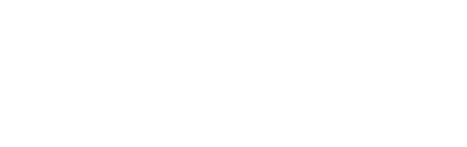

<p align="center">
  <a href="https://github.com/myos-dev/myOS">
    
  </a>
</p>

# myOS &nbsp; [](https://github.com/myos-dev/myOS/actions/workflows/build.yml)

myOS is an opinionated BootC image ecosystem organized around a shared `core` substrate, a feature-complete `full` core composition, clear per-distro layers, and GNOME desktop products that stay easy to extend.

# Image Progression

Both Alma 9 and 10 now follow one core tier plus GNOME desktop products:

- `core-full-alma9` / `core-full-alma10`
- `core-full-alma9-nvidia-open` / `core-full-alma10-nvidia-open`
- `core-full-alma9-nvidia-legacy`
- `gnome-alma9` / `gnome-alma10`
- `gnome-alma9-nvidia-open` / `gnome-alma10-nvidia-open`
- `gnome-alma9-nvidia-legacy`

NVIDIA streams are explicit:

- `-nvidia-open` uses the open kernel module path and is the default fit for newer supported GPUs.
- Alma 9 `-nvidia-legacy` is the older-GPU AI host lane. It pins the proprietary `nvidia-driver:580` stream and expects kernel-version-specific prebuilt `kmod-nvidia-*` packages on EL9 for Maxwell-, Pascal-, and similar legacy-supported GPUs.
- Alma 10 support in myOS is `-nvidia-open`.

For the legacy AI lane, keep the host driver and the AI userspace stack as separate decisions. The host stays on the pinned R580 proprietary branch, while older-GPU AI workloads should start from CUDA 12.6-class userspace stacks, such as PyTorch `cu126`, instead of assuming newer CUDA 13-era examples are the safest default for Maxwell/Pascal-class hardware.

`core-full-*` is the single full base tier. It includes tenant commands, persistent-user enrollment tooling, Cockpit admin services, shared ROCm userspace, the Kubernetes CLI, and OpenClaw platform-host scaffolding for both distros. CUDA repo/toolkit content is layered through the NVIDIA image paths rather than the plain non-NVIDIA `core-full-*` images.
Alma 10 also carries an optional packaged RamaLama host-service path in its distro-specific core layer. That feature is disabled by default and is not required for the tenant, `openclaw-host`, or per-user `openquad` runtime contracts.

For per-user OpenClaw on `core-full-*` and `gnome-*` images, the host contract is explicit:

- `openquad` manages the rootless per-user `openclaw.service` Quadlet runtime.
- The upstream `openclaw` CLI runs inside the container rather than through a separate host wrapper.
- Use `openquad exec -- ...` for one-shot commands or `openquad shell` to enter the runtime container interactively.

Typical flow:

```bash
openquad start
openquad exec -- openclaw onboard
openquad exec -- openclaw chat
openquad status
openquad doctor
```

The first `openquad start` renders the shipped per-user `openclaw.container`
into `~/.config/containers/systemd/` and starts the generated user service for
that user only. Lingering across logout still requires
`myos persistent-user-enroll --user <name>`. The runtime config file itself
lives at `~/.local/share/openclaw/openclaw.json`.
On first-time setups, `openquad start` now leaves the runtime up in a safe
unconfigured mode so `openquad exec -- openclaw onboard` can finish the initial
setup without a restart loop.

# Repo Layout

```text
recipes/
  images/
    core/
    gnome/
  layers/
    shared/
    alma9/
    alma10/
    features/

files/
  base/
  gnome/
  agent/
  dnf/
  justfiles/
```

- `recipes/images` contains only buildable images.
- `recipes/layers/shared` contains the shared composition layers: `core`, `full`, `gnome-base`, `nvidia-common`, `nvidia-cuda`, `nvidia-open`, and `nvidia-gnome`.
- `recipes/layers/alma9` and `recipes/layers/alma10` keep version differences explicit without spreading them across lots of tiny files.
- `modules/os-release-meta` runs first from `core`, before branding, and is the shared EL metadata source of truth. `core.yml` carries the shared EL Tailscale setup, base system, and common runtime defaults, while `full.yml` adds the platform-host scaffolding, shared AI/infrastructure tooling, and Kubernetes-ready operator surface used by the published `core-full-*` images. `gnome-base.yml` carries the shared GNOME desktop baseline in addition to the broader desktop tooling and Flatpak defaults used by the current GNOME family.
- `files/base`, `files/gnome`, and `files/agent` mirror those concerns in the payloads.

Kubernetes is now included in the published `core-full-*` image line via [`recipes/layers/features/kubernetes-cli.yml`](recipes/layers/features/kubernetes-cli.yml), so the full core/GNOME stack is ready to talk to Terraform and Kubernetes out of the box.

The full architecture and migration notes live in [`docs/image-architecture.md`](docs/image-architecture.md). The rootless persistence model lives in [`docs/rootless-persistence.md`](docs/rootless-persistence.md). Runtime ownership and path contracts live in [`docs/runtime-contracts.md`](docs/runtime-contracts.md). Validation guidance lives in [`docs/validation.md`](docs/validation.md). Current Alma 9 versus Alma 10 intentional drift is tracked in [`docs/alma-drift.md`](docs/alma-drift.md).

# Build Flow

The workflow now publishes full core images before GNOME builds run. GNOME recipes use `ghcr.io/myos-dev/core-full-*` as their base image, so the published GNOME tags reflect the latest published full core tags.

# Rootless Service Model

myOS keeps two rootless planes:

- persistent or background rootless services for dedicated tenant accounts and explicitly enrolled login users with lingering
- desktop or session rootless services for GNOME-only helpers that are separate from the per-user OpenClaw runtime

See [`docs/rootless-persistence.md`](docs/rootless-persistence.md) for the full model, including owner-only versus per-user baseline units and the supported self-service Quadlet path.

# Update Flow

myOS disables the stock `bootc-fetch-apply-updates.service` and `bootc-fetch-apply-updates.timer` so hosts do not surprise-reboot on their own. Use `myos update-system` or `myos rebase`, then reboot on your own schedule or during a maintenance window. For per-user runtime maintenance, `myos update-user` runs `openquad update` alongside the user-space refresh steps.

# Tenant Operations

The supported OpenClaw operator workflow is exposed through the `myos` just wrapper instead of hand-editing tenant files under `/srv/tenants`. That flow remains the dedicated service-account path for persistent background OpenClaw hosting.

Supported tenant operator surface:

- `tenant-create`
- `tenant-configure`
- `tenant-config`
- `tenant-secret-set`
- `tenant-secret-import`
- `tenant-start`, `tenant-stop`, `tenant-restart`
- `tenant-status`, `tenant-validate`, `tenant-dashboard`
- `tenant-tailscale`
- `tenant-backup`, `tenant-restore`, `tenant-remove`
- advanced tenant-context entry points: `tenant-models`, `tenant-openclaw`

The important tenant storage split is runtime state vs durable workspace vs
host-managed secrets. The current `zone-c/*` path names are legacy labels, not
an active multi-zone product concept.

Internal implementation helpers under `/usr/local/libexec/myos/tenant-*` still exist for reconciliation, rendering, and scaffolding, but they are not intended as the stable day-to-day operator surface.

Common tenant flows:

```bash
myos tenant-create --tenant demo
myos tenant-secret-set --tenant demo --key OPENROUTER_API_KEY
myos tenant-configure --tenant demo --model openrouter/anthropic/claude-sonnet-4-5
myos tenant-start --tenant demo
myos tenant-status --tenant demo
```

For persistent login users, use the separate enrollment flow:

```bash
myos persistent-user-enroll --user alice
myos persistent-user-set-owner --user alice
myos persistent-user-install-quadlet --file ./my-api.container --enable
```

For an owner-friendly hosted OpenClaw service that stays on the dedicated tenant
path and is easy to expose over Tailscale, use the wrapper surface:

```bash
myos openclaw-host enable --user alice --model openrouter/anthropic/claude-sonnet-4-5
myos openclaw-host secret-set --key OPENROUTER_API_KEY
myos openclaw-host start
myos openclaw-host tailscale enable
myos openclaw-host qr
```

That wrapper assigns the selected login user through the persistent-user owner
role, but it keeps the remotely exposed service on the dedicated `owner-openclaw`
tenant path instead of trying to repurpose the per-user `openquad` runtime.

Generic `myos` commands live in the shared core. Tenant commands, persistent-user commands, and the owner-host wrapper are layered into the `core-full-*` and GNOME images for both distros.

# Adding Images

1. Start from `core-full-*`, which is now the single published core tier.
2. Use `core-full-*` when the image needs tenant or OpenClaw host features.
3. Treat RamaLama as an Alma 10 full-core add-on until Alma 9 has a supported package source.
4. Use `nvidia-open.yml` for shared core/server NVIDIA support, `alma9/nvidia-legacy.yml` only for the EL9 proprietary R580 older-GPU AI path, and `nvidia-gnome.yml` only for GNOME-specific NVIDIA extras.
5. Add GNOME layers only for actual GNOME desktop products.
6. Keep optional capabilities in `recipes/layers/features/` instead of silently growing every image.

# Building as a VM

```bash
TMP=$(mktemp) && \
curl -fsSL https://raw.githubusercontent.com/myos-dev/myOS/stable/image.toml -o "$TMP" && \
sudo podman pull ghcr.io/myos-dev/gnome-alma10:latest && \
sudo podman pull quay.io/centos-bootc/bootc-image-builder:latest && \
sudo podman run --rm -it --privileged --pull=newer \
  --security-opt label=type:unconfined_t \
  --network=host \
  -v /var/lib/containers/storage:/var/lib/containers/storage \
  -v "$(pwd)/output:/output" \
  -v "$TMP:/config.toml:ro" \
  quay.io/centos-bootc/bootc-image-builder:latest \
  --type qcow2 \
  --progress verbose \
  --use-librepo=false \
  --config /config.toml \
  ghcr.io/myos-dev/gnome-alma10:latest
rm -f "$TMP"
```

The old single-stream `*-nvidia` image names were replaced by explicit `*-nvidia-open` images, with Alma 9 also retaining `*-nvidia-legacy` for the supported proprietary older-GPU AI path.

# Building ISO File

```bash
TMP=$(mktemp) && \
curl -fsSL https://raw.githubusercontent.com/myos-dev/myOS/stable/iso.toml -o "$TMP" && \
sudo podman pull ghcr.io/myos-dev/gnome-alma10:latest && \
sudo podman pull quay.io/centos-bootc/bootc-image-builder:latest && \
sudo podman run --rm -it --privileged --pull=newer \
  --security-opt label=type:unconfined_t \
  --network=host \
  -v /var/lib/containers/storage:/var/lib/containers/storage \
  -v "$(pwd)/output:/output" \
  -v "$TMP:/config.toml:ro" \
  quay.io/centos-bootc/bootc-image-builder:latest \
  --type iso \
  --progress verbose \
  --use-librepo=false \
  --config /config.toml \
  ghcr.io/myos-dev/gnome-alma10:latest
rm -f "$TMP"
```
